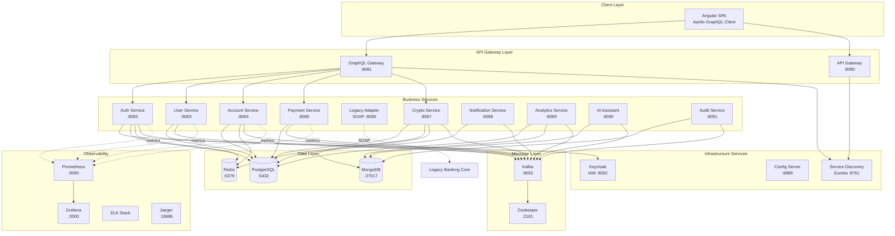
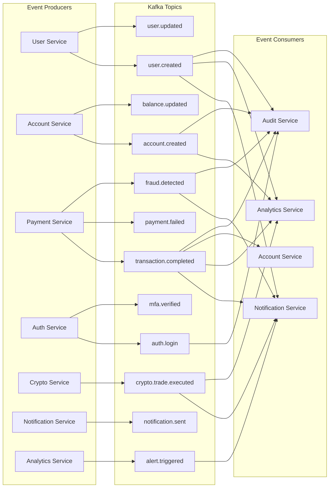
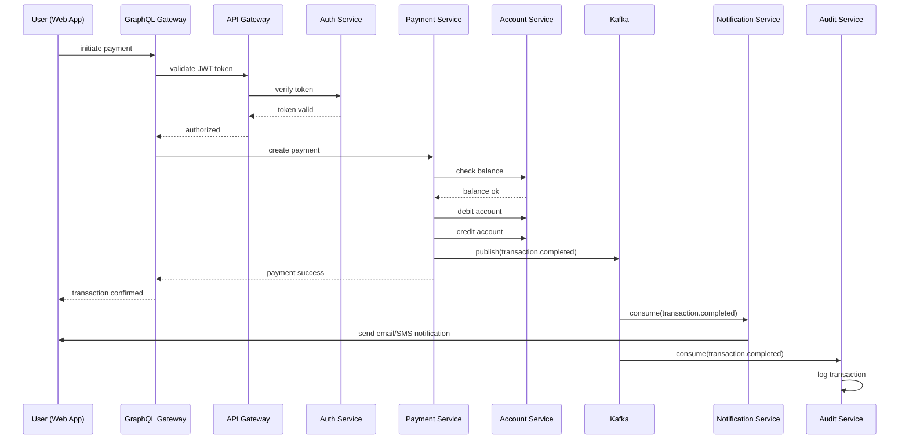

# E-Banking 3.0 - Nx Monorepo Microservices Architecture


## Executive Summary

E-Banking 3.0 is a modern, cloud-native banking platform built with microservices architecture using **Nx monorepo** for unified development and **Gradle** for Java service management. This project modernizes the legacy E-Banking 2.0 system with improved UX, scalability, and innovative features.

## Key Features

### Modernization
- **SPA Architecture**: Angular + Apollo GraphQL for optimized data fetching
- **Microservices**: Independent, scalable services with clear boundaries
- **Event-Driven**: Apache Kafka for asynchronous communication
- **Cloud-Native**: Docker + Kubernetes deployment

### New Capabilities
- **Crypto Portfolio**: Buy/sell cryptocurrency with real-time market data
- **AI Banking Assistant**: ChatGPT/Dialogflow integration for customer support
- **Biometric Payments**: Enhanced security with biometric authentication + QR codes
- **Advanced Analytics**: Interactive dashboards and budget management
- **Legacy Integration**: SOAP adapter for existing banking core systems

## Architecture Overview

### Simple Overview


```
┌─────────────────────────────────────────────────────────────────┐
│          Frontend SPA (Angular + Apollo GraphQL)                │
└────────────────────────┬────────────────────────────────────────┘
                         │
                         ↓
┌─────────────────────────────────────────────────────────────────┐
│                  GraphQL API Gateway (8081)                     │
│            Aggregates data from microservices                   │
└────────────────────────┬────────────────────────────────────────┘
                         │
        ┌────────────────┼────────────────┐
        ↓                ↓                ↓
┌───────────────┐ ┌───────────────┐ ┌───────────────┐
│  Auth Service │ │ User Service  │ │Account Service│
│     (8082)    │ │    (8083)     │ │    (8084)     │
└───────┬───────┘ └───────┬───────┘ └───────┬───────┘
        │                 │                 │
        └─────────────────┼─────────────────┘
                          ↓
                 ┌─────────────────┐
                 │  Kafka Event Bus│
                 │  (async events) │
                 └─────────────────┘
```

### High-Level Architecture



### Event-Driven Architecture (Kafka Topics)



### Database Architecture (Database per Service)

```mermaid
graph TB
    subgraph "PostgreSQL Schemas"
        PG[(PostgreSQL :5432)]
        PG --> AUTH_SCHEMA[auth schema]
        PG --> USER_SCHEMA[users schema]
        PG --> ACCOUNT_SCHEMA[accounts schema]
        PG --> PAYMENT_SCHEMA[payments schema]
        PG --> CRYPTO_SCHEMA[crypto schema]
        PG --> NOTIF_SCHEMA[notifications schema]
        PG --> ANALYTICS_SCHEMA[analytics schema]
    end

    subgraph "MongoDB Collections"
        MG[(MongoDB :27017)]
        MG --> CRYPTO_COLL[crypto_history]
        MG --> AI_COLL[ai_conversations]
        MG --> AUDIT_COLL[audit_logs]
        MG --> METRICS_COLL[analytics_metrics]
    end

    subgraph "Redis Cache"
        RD[(Redis :6379)]
        RD --> SESSIONS[Sessions]
        RD --> CACHE[API Cache]
        RD --> RATE[Rate Limiting]
    end

    subgraph "Services"
        AUTH[Auth Service]
        USER[User Service]
        ACCOUNT[Account Service]
        PAYMENT[Payment Service]
        CRYPTO[Crypto Service]
        NOTIF[Notification Service]
        ANALYTICS[Analytics Service]
        AI[AI Assistant]
        AUDIT[Audit Service]
        API_GW[API Gateway]
    end

    AUTH -.->AUTH_SCHEMA
    AUTH -.-> SESSIONS
    USER -.-> USER_SCHEMA
    ACCOUNT -.-> ACCOUNT_SCHEMA
    ACCOUNT -.-> CACHE
    PAYMENT -.-> PAYMENT_SCHEMA
    CRYPTO -.-> CRYPTO_SCHEMA
    CRYPTO -.-> CRYPTO_COLL
    NOTIF -.-> NOTIF_SCHEMA
    ANALYTICS -.-> ANALYTICS_SCHEMA
    ANALYTICS -.-> METRICS_COLL
    AI -.-> AI_COLL
    AUDIT -.-> AUDIT_COLL
    API_GW -.-> RATE
```



### Request Flow Example: User Transaction



## Technology Stack

### Core Technologies
- **Monorepo**: Nx 22.1.3 (unified build system, dependency graph, caching)
- **Build Tool**: Gradle 9.2.1 (multi-project builds for Java services)
- **Backend**: Spring Boot 3.3.5, Spring Cloud 2023.0.0
- **Frontend**: Angular 19+ with Apollo GraphQL Client
- **API**: GraphQL Gateway + REST APIs
- **Event Bus**: Apache Kafka 3.6.1
- **Service Discovery**: Netflix Eureka
- **Configuration**: Spring Cloud Config Server
- **Security**: Keycloak (OAuth2/OIDC), JWT, MFA

### Databases
- **PostgreSQL**: Transactional data (accounts, transactions, users)
- **MongoDB**: Logs, crypto history, AI conversations, audit trails
- **Redis**: Caching, sessions, rate limiting

### Observability
- **Metrics**: Prometheus + Grafana
- **Logs**: ELK Stack (Elasticsearch, Logstash, Kibana)
- **Tracing**: Jaeger (distributed tracing)
- **Monitoring**: Spring Boot Actuator

### DevOps
- **Containers**: Docker
- **Orchestration**: Kubernetes + Helm
- **CI/CD**: GitHub Actions
- **IaC**: Terraform

## Monorepo Structure

```
E-Banking-3.0/
├── apps/
│   ├── infrastructure/              # Infrastructure microservices
│   │   ├── service-discovery/       # Eureka Server (8761)
│   │   ├── config-server/           # Spring Cloud Config (8888)
│   │   ├── api-gateway/             # REST API Gateway (8080)
│   │   └── graphql-gateway/         # GraphQL Gateway (8081)
│   │
│   ├── services/                    # Business microservices
│   │   ├── auth-service/            # Authentication & MFA (8082)
│   │   ├── user-service/            # User Profiles & KYC (8083)
│   │   ├── account-service/         # Account Management (8084)
│   │   ├── payment-service/         # Payments & Transfers (8085)
│   │   ├── legacy-adapter-service/  # SOAP to REST Bridge (8086)
│   │   ├── crypto-service/          # Cryptocurrency Ops (8087)
│   │   ├── notification-service/    # Email/SMS/Push (8088)
│   │   ├── analytics-service/       # Dashboards & Alerts (8089)
│   │   ├── ai-assistant-service/    # AI Chatbot (8090)
│   │   └── audit-service/           # Compliance & Audit (8091)
│   │
│   └── frontend/                    # Frontend applications (future)
│       └── web-app/                 # Angular SPA
│
├── libs/
│   └── shared/                      # Shared libraries
│       ├── common/                  # Common utilities
│       ├── kafka-events/            # Event schemas & Kafka config
│       ├── security/                # Security components
│       ├── dto/                     # Data Transfer Objects
│       └── exceptions/              # Custom exception handling
│
├── tools/
│   ├── docker/                      # Docker configurations
│   │   ├── init-db.sql             # Database initialization
│   │   └── prometheus.yml          # Prometheus config
│   ├── kubernetes/                  # Kubernetes manifests
│   │   ├── helm-charts/            # Helm charts
│   │   └── terraform/              # Infrastructure as Code
│   └── scripts/                     # Utility scripts
│
├── build.gradle                     # Root Gradle configuration
├── settings.gradle                  # Gradle multi-project settings
├── gradlew                          # Gradle wrapper
├── nx.json                          # Nx workspace configuration
├── package.json                     # Node.js dependencies & scripts
├── docker-compose.yml               # Docker Compose for local dev
└── README.md                        # This file
```

## Microservices Overview

### Infrastructure Services

| Service | Port | Purpose | Tech Stack |
|---------|------|---------|------------|
| **Service Discovery** | 8761 | Service registration & discovery | Eureka Server |
| **Config Server** | 8888 | Centralized configuration | Spring Cloud Config |
| **API Gateway** | 8080 | Request routing, load balancing | Spring Cloud Gateway |
| **GraphQL Gateway** | 8081 | Unified GraphQL API | Spring GraphQL |

### Business Services

| Service | Port | Database | Purpose |
|---------|------|----------|---------|
| **Auth Service** | 8082 | PostgreSQL, Redis | Authentication, MFA, sessions |
| **User Service** | 8083 | PostgreSQL | User profiles, KYC, GDPR |
| **Account Service** | 8084 | PostgreSQL, Redis | Account management, balances |
| **Payment Service** | 8085 | PostgreSQL, Redis | Transfers, anti-fraud |
| **Legacy Adapter** | 8086 | None (proxy) | SOAP to REST bridge |
| **Crypto Service** | 8087 | PostgreSQL, MongoDB, Redis | Cryptocurrency operations |
| **Notification Service** | 8088 | PostgreSQL | Email, SMS, push notifications |
| **Analytics Service** | 8089 | PostgreSQL, MongoDB, Redis | Dashboards, alerts |
| **AI Assistant** | 8090 | MongoDB | ChatGPT/Dialogflow chatbot |
| **Audit Service** | 8091 | MongoDB | Compliance, audit logs |

## Communication Patterns

### 1. Synchronous (REST)
- Service-to-service calls via OpenFeign
- Example: Payment Service → Account Service (balance check)

### 2. Asynchronous (Kafka)
- Event-driven architecture
- Example: `transaction.completed` → Notification, Analytics, Audit

### 3. GraphQL Aggregation
- Multi-service data fetching in single query
- Example: User + Accounts + Transactions in one request

### 4. Legacy Integration (SOAP)
- SOAP adapter for legacy banking core
- Example: Payment validation, balance sync

## Getting Started

### Prerequisites

- **Java 21**
- **Gradle 9.2.1** (or use wrapper: `./gradlew`)
- **Node.js 18+** and npm
- **Docker & Docker Compose**
- **Nx CLI**: `npm install -g nx` (optional)

### Quick Start

1. **Clone and install**
   ```bash
   git clone <repository-url>
   cd E-Banking-3.0
   npm install
   ```

2. **Build all services**
   ```bash
   ./gradlew build
   # or
   npm run gradle:build
   ```

3. **Start infrastructure**
   ```bash
   docker-compose up -d postgres mongodb redis kafka zookeeper keycloak
   ```

4. **Run services**
   ```bash
   # Option 1: Run specific service with Gradle
   ./gradlew :apps:services:user-service:bootRun

   # Option 2: Start all services with Docker
   npm run docker:up
   ```

### Development Commands

#### Nx Commands
```bash
npm run build              # Build all projects
npm run build:affected     # Build only affected projects
npm run test               # Run all tests
nx graph                   # View dependency graph
```

#### Gradle Commands
```bash
./gradlew build                                    # Build all services
./gradlew :apps:services:user-service:build       # Build specific service
./gradlew :apps:services:user-service:bootRun     # Run specific service
./gradlew test                                     # Run all tests
./gradlew clean                                    # Clean build artifacts
```

#### Docker Commands
```bash
npm run docker:up          # Start all services
npm run docker:down        # Stop all services
npm run docker:logs        # View logs
npm run docker:build       # Rebuild images
```

## Kafka Event Topics

| Topic | Producer | Consumers | Purpose |
|-------|----------|-----------|---------|
| `user.created` | User Service | Notification, Analytics, Audit | New user registration |
| `account.created` | Account Service | Crypto, Analytics, Audit | New account |
| `transaction.completed` | Payment Service | Notification, Analytics, Account, Audit | Transaction success |
| `payment.failed` | Payment Service | Notification, Audit | Payment failure |
| `fraud.detected` | Payment Service | Notification, Audit | Fraud alert |
| `crypto.trade.executed` | Crypto Service | Notification, Analytics, Audit | Crypto transaction |
| `auth.login` | Auth Service | Audit | User login |
| `notification.sent` | Notification Service | Audit | Notification delivery |
| `alert.triggered` | Analytics Service | Notification | Budget/threshold alert |

## Security & Compliance

### Authentication
- OAuth2/OIDC via Keycloak
- JWT tokens for stateless auth
- MFA (SMS + Biometric)
- RBAC: CLIENT, AGENT, ADMIN roles

### GDPR Compliance
- Consent management (User Service)
- Right to erasure workflows
- Comprehensive audit trails
- Automated data anonymization

### Security Features
- TLS/SSL for all communications
- JWT validation at API Gateway
- Service-to-service authentication
- Rate limiting and throttling
- Secrets management

## Observability Dashboards

| Tool | URL | Credentials |
|------|-----|-------------|
| **Eureka Dashboard** | http://localhost:8761 | - |
| **Grafana** | http://localhost:3000 | admin/admin |
| **Prometheus** | http://localhost:9090 | - |
| **Kibana** | http://localhost:5601 | - |
| **Jaeger** | http://localhost:16686 | - |
| **Keycloak** | http://localhost:8092 | admin/admin |

## Database Configuration

### PostgreSQL Schemas
- `auth` - Auth Service
- `users` - User Service
- `accounts` - Account Service
- `payments` - Payment Service
- `crypto` - Crypto Service
- `notifications` - Notification Service
- `analytics` - Analytics Service

### MongoDB Collections
- `crypto_history` - Crypto Service
- `ai_conversations` - AI Assistant
- `audit_logs` - Audit Service
- `analytics_metrics` - Analytics Service

## Deployment

### Docker Compose (Local)
```bash
docker-compose up -d
```

### Kubernetes (Production)
```bash
# Using Helm
helm install ebanking ./tools/kubernetes/helm-charts/ebanking

# Using kubectl
kubectl apply -f tools/kubernetes/manifests/
```

## CI/CD Pipeline

1. Lint & Format Check
2. Gradle Build (all services)
3. Unit Tests
4. Integration Tests
5. SonarQube Analysis
6. Docker Image Build
7. Push to Registry
8. Deploy to Staging (K8s)
9. E2E Tests
10. Deploy to Production (approval required)

## Why Nx Monorepo?

✅ **Unified Build System**: Single command builds all services
✅ **Dependency Graph**: Visualize service dependencies
✅ **Smart Rebuilds**: Only rebuild affected services
✅ **Caching**: Dramatically faster builds
✅ **Code Sharing**: Shared libraries across services
✅ **Consistent Tooling**: Same commands for all services

## Why Gradle for Java?

✅ **Dependency Management**: Centralized version control
✅ **Parallel Builds**: Build services concurrently
✅ **Incremental Builds**: Only rebuild changed modules
✅ **Plugin System**: Shared configurations
✅ **Java Ecosystem**: First-class Java/Kotlin support

## Migration from E-Banking 2.0

1. **Parallel Run**: Both systems running simultaneously
2. **Data Migration**: MySQL → PostgreSQL/MongoDB
3. **Feature Parity**: All features available in 3.0
4. **Gradual Cutover**: Phased user migration
5. **Legacy Integration**: SOAP adapter for backward compatibility

## Contributing

1. Create feature branch from `main`
2. Make changes and add tests
3. Run `npm run build && npm run test`
4. Submit pull request
5. Code review and CI/CD validation
6. Merge to `main`

## Testing

```bash
# Unit tests
./gradlew test

# Integration tests
./gradlew integrationTest

# E2E tests
npm run test:e2e
```

## Documentation

- Original Implementation Plan: [README.old.md](./README.old.md)
- Architecture Details: See below sections
- API Documentation: Auto-generated via Swagger/GraphQL Playground

## Support

For issues and questions:
- Create GitHub Issue
- Check Documentation Wiki

## License

ISC License

## Team

E-Banking Development Team

---

**Version**: 3.0.0
**Last Updated**: December 2025
**Built with**: Nx + Gradle + Spring Boot + GraphQL + Kafka
